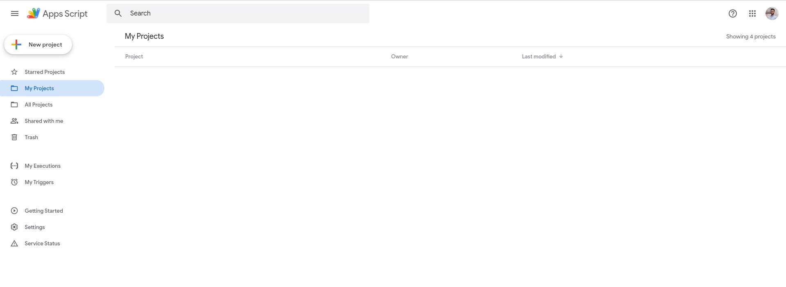
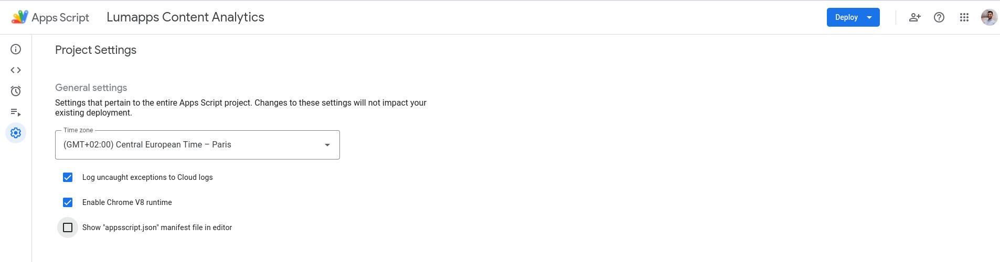
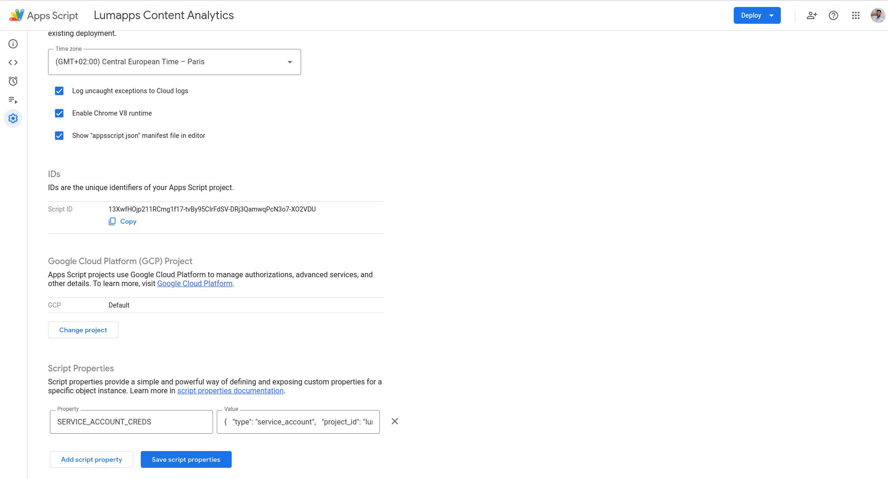
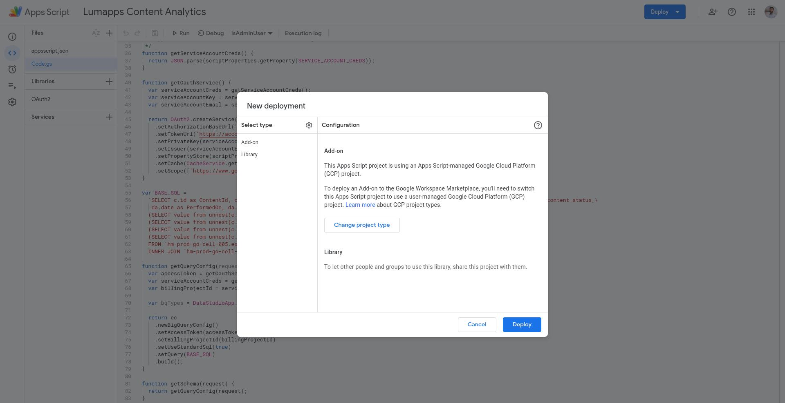
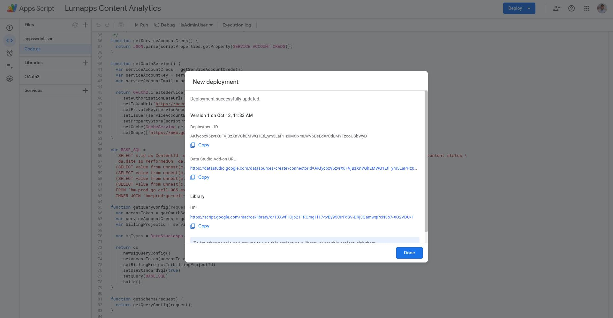
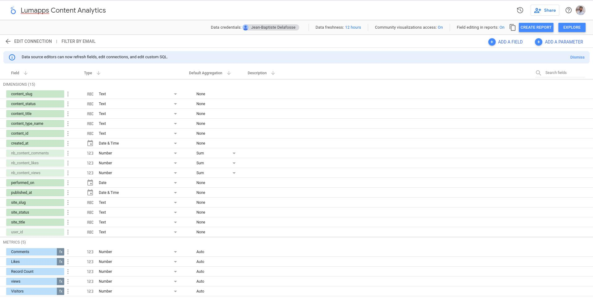
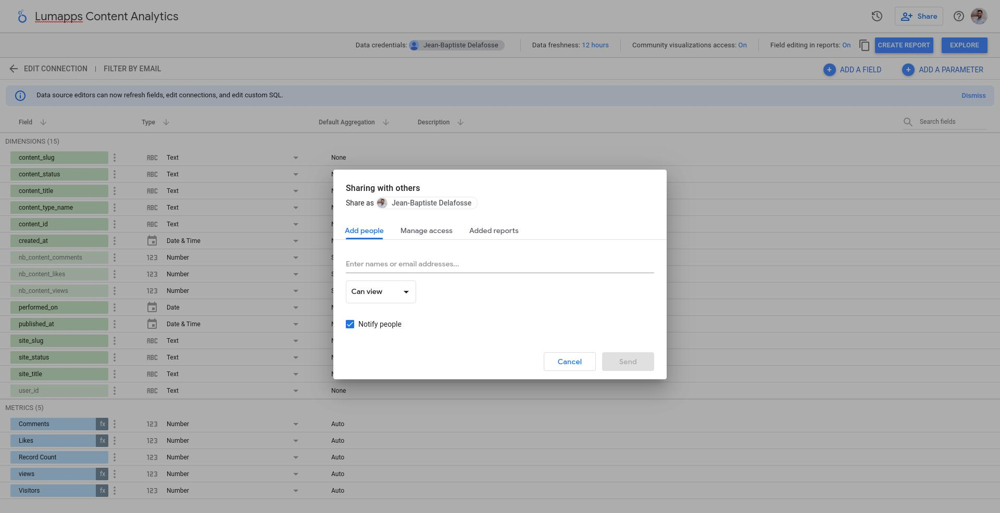
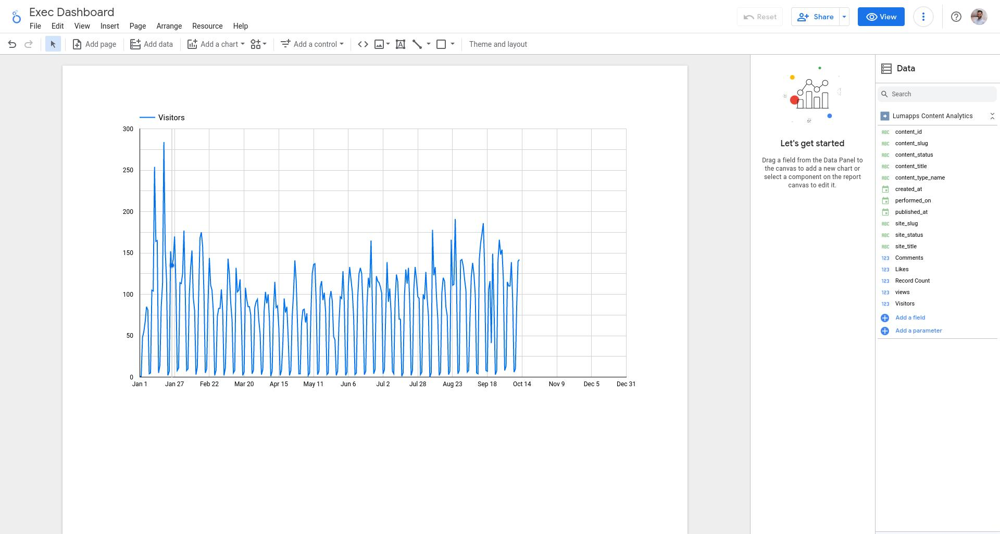

# Using Google Data Studio with the Lumapps Datalake

## Connecting Google Data Studio to the lumapps datalake

This documentation explains how you can setup a connection from google datastudio to the Lumapps Datalake.

**prerequisite**:
* You already have created a service account and this service account was given proper permissions by the lumapps team.

### Step 1 : Create your first connector based of an example

DataStudio does not support natively the connection to google BigQuery via Service Account.

If you want to connect Datastudio to BigQuery using a service account, you need to setup a custom connector.
Google gives an example of how it could be done in [their documentation](https://developers.google.com/datastudio/solution/blocks/using-service-accounts) 

Lumapps tested this method and the connector we built can be used as a template.
The source code can be found [here](./examples)

1. Open the Json Key file of your service account.
2. Edit `"project_id": "your-project"` to `"project_id": "lumapps-datalake-external"`
3. Save the file, we will need it later
4. Open the [google apps script interface](https://script.google.com/)

5. Create a new project
6. Display the manifest file via the option in the project settings

7. Copy and Paste the connector code [here](./examples/code.gs) into `code.gs`
8. Copy and Paste the connector manifest [here](./examples/appscript.json) into a new file called`appscript.json`
9. In `code.gs`, change `YOUR-PROD-PROJECT` on the lines 62-63 by the GCP project where your data is located (It looks like `hm-prod-xx-cell-xx`)
10. In `appscript.json`, change the name of your connector line 16 to something that makes sense in your organization and the specific data exposed in the connector via the SQL query in `code.gs`. In this tutorial `Lumapps Content Analytics` is an appropriate name.
11. Create a new entry in the script properties, Enter the Json Keyfile of your service account, edited at the begining of this tutorial, as a json string in the script properties of your custom connector with the key SERVICE_ACCOUNT_CREDS. Make sure to **Save Script Properties**

12. Click on the **Deploy** button to create a new deployment. Deployment type should be Addon + Library

13. If your deployment is correct, you should see a **DataStudio URL**. Click on it.

14. **Authorize** the connector, and allow the requested permission. Then click on **Connect**
15. You can now create a Google datastudio "Datastource"
    1. Rename it as you like, you might share it within your organization so the name you choose need to make sense in that context.
    2. rename/hide dimensions as you would like.
    3. create new fields to expose new "Metrics" as you would like.

16. You can now share this datasource within your organization to people that wants to create their own dashboards.

17. You can also use this datasource to create a dashboard (=a Report) right now. You can share the report to people that need to view the dashboard.

### Step 2 : Going further

In the previous step, you created your first datastudio connector and you shared it within your organization via a datastudio datastource or a datastudio report
You might want to explore other data in the lumapps datalake.

To do so :

1. **Explore** the data available on the [documentation](https://developer.lumapps.com/datalake)
2. **Create your own new connectors** by replicating what you did in the tutorial and updating the SQL query within the connector.
   1. Read about [BigQuery Specifics](../bigquery-specifics.md)
