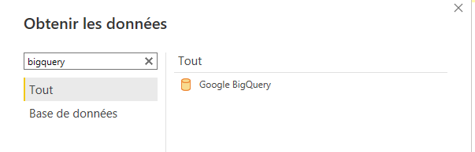
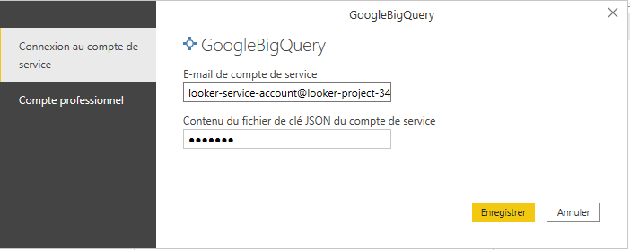
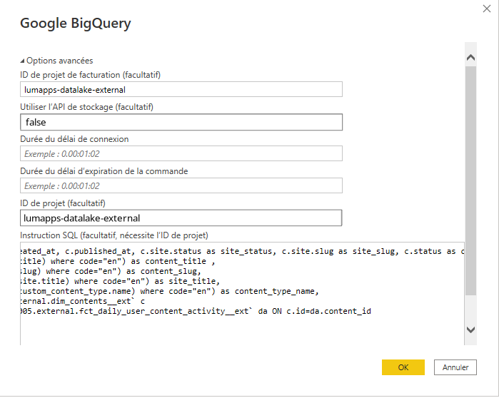

# Using PowerBI with the Lumapps Datalake

## Connecting PowerBI software to the lumapps datalake

**prerequisite**: You already have created a service account and this service account was given proper permissions by the lumapps team.


### Step 1 : Setup the BigQuery Connector

- Setup a new connection to `Google BigQuery` in PowerBI



- Choose a connection via `Service Principal`.



- Enter the email address of your service account.
- Enter the Json Key file of your Service account.
**IMPORTANT: PowerBI requires the Json Key file to be a single line therefore you will need to edit the default one provided by google.**

### Step 2 : Edit the advanced connection settings


- Select the "Billing Project" : `lumapps-datalake-external`
- Set "Use Storage API" to : `false`
- ID of the project is necessary to fill a custom SQL Query : `lumapps-datalake-external`
- You will also need to fill a custom SQL query.


### Step 3 : Writing the Custom SQL query

You will need to write a custom SQL query for 2 reasons:
1. The data is stored on a GCP project not listed in the PowerBI interface. 
2. The data is stored in a format optimised for Google BigQuery. This format is understood by PowerBI most of the time :
the principal exception being all the fields that can be translated (see [Translatable Fields in Lumapps Datalake](../bigquery-specifics.md)).
It means all the table with a translatable field won't be well understood by tableau by default. You will need to create Custom SQL to explore those tables.

The query should target tables using the [BigQuery table format](../bigquery-specifics.md)

#### An Example of a Custom SQL Query joing the `dim_contents__ext` with `fct_daily_user_content_activity__ext`

This query allows you to analyse the activity on contents by content dimension.

``` sql
SELECT c.id as content_id, c.created_at, c.published_at, c.site.status as site_status, c.site.slug as site_slug, c.status as content_status,   da.date as performed_on, da.nb_content_comments, da.nb_content_likes, da.nb_content_views, da.user_id,
(SELECT value from unnest(c.title) order by code limit 1) as content_title ,
(SELECT value from unnest(c.slug) order by code limit 1) as content_slug,
(SELECT value from unnest(c.site.title) order by code limit 1) as site_title,
(SELECT value from unnest(c.custom_content_type.name) order by code limit 1) as content_type_name,
FROM `hm-prod-go-cell-001.external.dim_contents__ext` c
INNER JOIN `hm-prod-go-cell-001.external.fct_daily_user_content_activity__ext` da ON c.id=da.content_id
```

