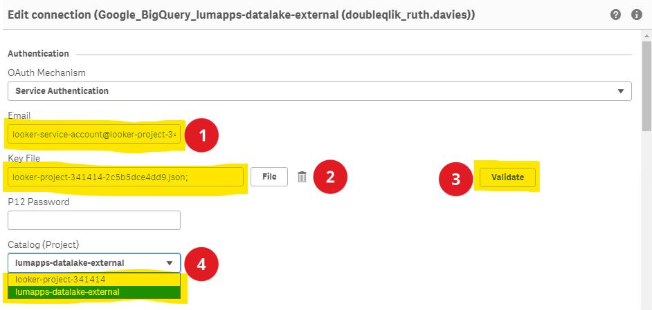
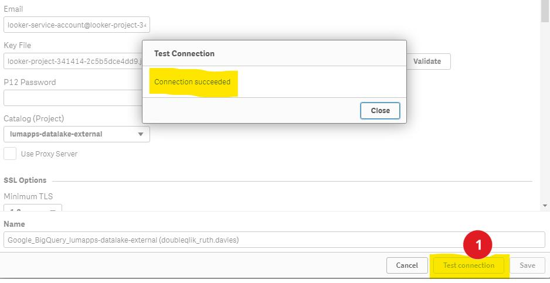
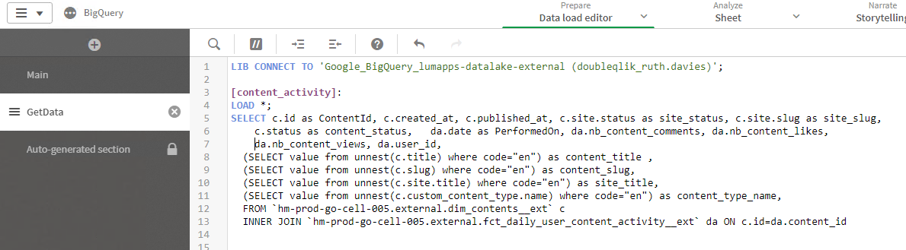
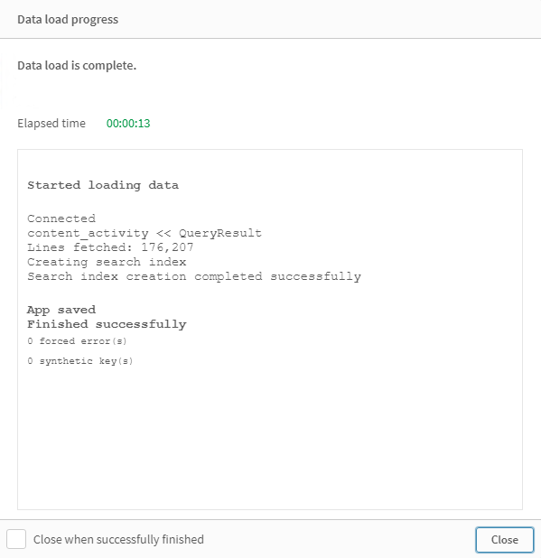

# Using Qlik with the Lumapps Datalake

## Connecting Qlik to the lumapps datalake

**prerequisite**: You already have created a service account and this service account was given proper permissions by the lumapps team.

### Step 1 : BigQuery Connector

- Setup a connection to `Google BigQuery` in the Data Load Editor
- Select OAuth Mechanism : `Service Authentication`
- Enter the email of your service account and provide its json key file
- Clic on the "Validate" button to populate the `Catalog (Project)` drop down
- Select `Catalog (Project)` : `lumapps-datalake-external`




- The “Test connection” button at the bottom of the dialog allows to do one more test before saving the connection
- It is convenient to give a short but unique name to the connection in the space provided at the bottom under “Name” 



### Step 2 : Writing the Data Loader

You will need to write a Data Loader in SQL a query(ies) for 2 reasons:
1. The data is stored on a GCP project not listed in the Qlik interface. 
2. The data is stored in a format optimised for Google BigQuery. This format is understood by Qlik most of the time :
the principal exception being all the fields that can be translated (see [Translatable Fields in Lumapps Datalake](../bigquery-specifics.md)).
It means all the table with a translatable field won't be well understood by Qlik by default. You will need to create Custom SQL to explore those tables.



In the Data load editor, the connection must be opened and then the query(ies) follows:
1. Line 1 indicates that we will use the connection created before (this is where a shorter connection name is more convenient)
2. Line 3 sets the name of the table being created in Qlik Sense
3. On line 4, the `Load *;` statement is simple for the test, but could include renaming, transformations, functions, lookups, etc.
4. Line 5 and below is where you can write a query.


The query should target tables using the [BigQuery table format](../bigquery-specifics.md)

#### An Example of a Custom SQL Query for the `dim_contents__ext`


``` sql
SELECT c.id, c.created_at, c.published_at, c.site.status as site_status, c.site.slug as site_slug, c.status as content_status, 
(SELECT value from unnest(c.title) where code="en") as content_title ,
(SELECT value from unnest(c.slug) where code="en") as content_slug,
(SELECT value from unnest(c.site.title) where code="en") as site_title,
(SELECT value from unnest(c.custom_content_type.name) where code="en") as content_type_name,
FROM hm-prod-go-cell-005.external.dim_contents__ext c 
```

You can now load the data


