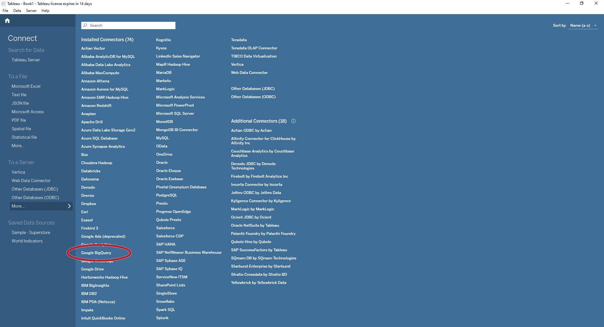

# Using Tableau Software with the LumApps Datalake

## Connecting Tableau software to the LumApps datalake

**prerequisite**:
* You already have created a service account and this service account was given proper permissions by the lumapps team.
* You have access to Tableau Desktop (**must be version 2021.3 or above**), connection to BigQuery via service account is not yet supported by Tableau Online

### Step 1 : BigQuery Connector

- Setup a new data source and choose `Google BigQuery`.
- Select `Connect via a service account`
- Enter your credentials




### Step 2 : Entering the connection Settings


You now need to setup the connection settings:

1. Setup your **billing project**: it is always `lumapps-datalake-external`
2. Setup your **Project**: it is the GCP project hosting the data. It should have been given to you by your Lumapps Representative. It looks like `hm-prod-{go/ms}-cell-XXX`
It is not listed by default and you should click on the `+` icon to enter it manually
3. Setup the **dataset**: is is always `external`
4. You should now see listed **many tables**. The definition of what data is available in each table is available [here](https://developer.lumapps.com/datalake)

### Step 3 : Custom SQL

The data is stored in a format optimised for Google BigQuery.

This format is understood by Tableau most of the time : the principal exception being all the fields that can be translated (see [Translatable Fields in Lumapps Datalake](../bigquery-specifics.md))
It means all the table with a translatable field won't be well understood by tableau by default. You will need to create Custom SQL to explore those tables.

The ideal way to do so in Tableau is to create one custom SQL query per table, and join those custom SQL in Tableau.

1. Create a new Custom SQL query
2. Enter the query
3. We advise you to use `Connection: Extract` to save some data on your daily quota

#### An Example of a Custom SQL Query for the `dim_contents__ext`

``` sql
SELECT c.id, c.created_at, c.published_at, c.site.status as site_status, c.site.slug as site_slug, c.status as content_status, 
(SELECT value from unnest(c.title) where code="en") as content_title ,
(SELECT value from unnest(c.slug) where code="en") as content_slug,
(SELECT value from unnest(c.site.title) where code="en") as site_title,
(SELECT value from unnest(c.custom_content_type.name) where code="en") as content_type_name,
FROM hm-prod-go-cell-005.external.dim_contents__ext c 
```

